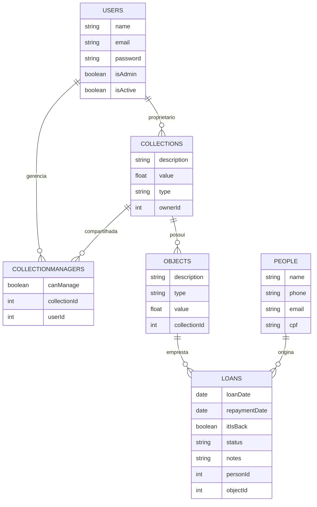

# **Controle de Acervo** - API REST

Aplicação demonstrativa utilizada nas aulas de Programacao para Internet II com foco em construcao de uma API REST. O backend permite cadastrar usuarios, organizar colecoes de objetos, registrar emprestimos e acompanhar devolucoes utilizando Node.js, Express e Sequelize com banco SQLite.

## Visao Geral

O objetivo do projeto **Controle de Acervo** e oferecer um fluxo completo de cadastro, emprestimo e organizaçãoo de itens (livros, equipamentos, componentes, ferramentas etc.). A API trabalha com dois níveis de permissão (usuario comum e administrador) e contempla compartilhamento de coleções, acompanhamento de pessoas que recebem os itens e controle de status de emprestimo.

## Principais Recursos
- Cadastro e autenticacao de usuarios com perfis `user` e `admin`.
- Gerenciamento de coleções e objetos com possibilidade de compartilhamento entre usuarios.
- Registro de pessoas externas que recebem os emprestimos.
- Controle de emprestimos com datas de retirada e devolucao, incluindo status `itIsBack`.
- Estrutura pensada para atividades em sala, com espacos para evolucoes guiadas.

## Perfis e Casos de Uso
- **Visitante**: pode criar conta e efetuar login.
- **Usuario autenticado**: pode editar os proprios dados, criar/editar colecoes, registrar objetos, registrar emprestimos e gerenciar pessoas ligadas aos emprestimos.
- **Administrador**: herda todas as permissoes do usuario comum e ainda pode promover ou rebaixar usuarios, desativar contas, compartilhar colecoes e remover registros de pessoas ou colecoes quando necessario.


## Tecnologias e Dependencias
- Node.js (versao recomendada 18 ou superior)
- Express 5
- Sequelize 6 + SQLite3
- bcrypt para hash de senhas
- jsonwebtoken (JWT) para autenticacao baseada em token
- dotenv para gerenciamento de variaveis de ambiente

## Estrutura de Pastas (  )
```
project-root/
  src/
    config/
      db.js

    modules/
      user/
        user.model.js
        user.service.js
        user.controller.js
        user.routes.js

      collection/
        collection.model.js
        collection.service.js
        collection.controller.js
        collection.routes.js

      object/
        object.model.js
        object.service.js
        object.controller.js
        object.routes.js

      collectionManager/
        collectionManager.model.js
        collectionManager.service.js
        collectionManager.controller.js
        collectionManager.routes.js

      loan/
        loan.model.js
        loan.service.js
        loan.controller.js
        loan.routes.js

      person/
        person.model.js
        person.service.js
        person.controller.js
        person.routes.js

    middleware/
      authenticate.js

    database/
      database.sqlite
      migrations/

    index.js

  testeApi.http
  .env
```

## Modelos Sequelize

### Usuario (`src/modules/user/user.model.js`)
- `name`: string obrigatoria.
- `email`: string obrigatoria e unica.
- `password`: string obrigatoria (armazenada com hash).
- `isAdmin`: booleano, padrao `false`.
- `isActive`: booleano, padrao `true` para soft delete.

### Colecao (`src/modules/collection/collection.model.js`)
- `name`: string obrigatoria.
- `description`: texto opcional.
- `type`: string obrigatoria indicando a categoria.
- `value`: numero opcional para valor estimado.
- `ownerId`: inteiro obrigatorio (FK para `User`).

### Objeto (`src/modules/object/object.model.js`)
- `description`: string obrigatoria.
- `type`: string obrigatoria.
- `value`: numero opcional.
- `collectionId`: inteiro obrigatorio (FK para `Collection`).

### Pessoa (`src/modules/person/person.model.js`)
- `name`: string obrigatoria.
- `phone`: string obrigatoria.
- `email`: string obrigatoria.
- `cpf`: string obrigatoria.

### Emprestimo (`src/modules/loan/loan.model.js`)
- `loanDate`: data obrigatoria de retirada.
- `repaymentDate`: data obrigatoria esperada para devolucao.
- `itIsBack`: booleano (padrao `false`).
- `status`: string (padrao `pending`).
- `notes`: texto opcional.
- `personId`: inteiro obrigatorio (FK para `Person`).
- `objectId`: inteiro obrigatorio (FK para `Object`).

### Gestores de Coleção (`src/modules/collectionManager/collectionManager.model.js`)
- `collectionId`: inteiro obrigatorio (FK para `Collection`).
- `userId`: inteiro obrigatorio (FK para `User`).
- `canManage`: booleano (padrao `true`).

## Relacionamentos
- `User` 1:N `Collection` via `ownerId`.
- `Collection` 1:N `Object` via `collectionId`.
- `Person` 1:N `Loan` via `personId`.
- `Object` 1:N `Loan` via `objectId` (atuando como associativa entre `Object` e `Person`).
- `User` N:M `Collection` via `CollectionManager` (com atributo `canManage`).

### Diagrama ER



## Endpoints da API

#### Rotas Públicas (`src/modules/user/user.routes.js`)
| Metodo | Rota | Descricao |
| --- | --- | --- |
| POST | `/cadastro` | Cria um novo usuário (hash automático de senha). |
| POST | `/login` | Valida credenciais e devolve token JWT. |

#### Rotas Usuários (`src/modules/user/user.routes.js`)
Todas exigem header `Authorization: Bearer <token>`.

| Metodo | Rota | Descricao |
| --- | --- | --- |
| GET | `/listarUsuarios` | Lista usuários (sem senha). |
| POST | `/atualizarUsuario` | Atualiza dados de um usuário existente. |
| POST | `/deletarUsuario` | (Admin) Desativa usuário. |
| POST | `/promoverUsuario` | (Admin) Promove usuário a administrador. |

#### Rotas Coleções (`src/modules/collection/collection.routes.js`)
| Metodo | Rota | Descricao |
| --- | --- | --- |
| GET | `/collections` | Lista coleções (token). |
| POST | `/collections` | Cria coleção (admin; `ownerId` vem do token). |
| POST | `/collections/update` | Atualiza coleção (admin). |
| POST | `/collections/delete` | Remove coleção (admin). |

#### Rotas Objetos (`src/modules/object/object.routes.js`)
| Metodo | Rota | Descricao |
| --- | --- | --- |
| GET | `/objects` | Lista objetos (token). |
| POST | `/objects` | Cria objeto (admin). |
| POST | `/objects/update` | Atualiza objeto (admin). |
| POST | `/objects/delete` | Remove objeto (admin). |

#### Rotas Pessoas (`src/modules/person/person.routes.js`)
| Metodo | Rota | Descricao |
| --- | --- | --- |
| GET | `/people` | Lista pessoas (token). |
| POST | `/people` | Cria pessoa (admin). |
| POST | `/people/update` | Atualiza pessoa (admin). |
| POST | `/people/delete` | Remove pessoa (admin). |

#### Rotas Empréstimos (`src/modules/loan/loan.routes.js`)
| Metodo | Rota | Descricao |
| --- | --- | --- |
| GET | `/loans` | Lista empréstimos (token). |
| POST | `/loans` | Cria empréstimo (admin). |
| POST | `/loans/update` | Atualiza empréstimo (admin). |
| POST | `/loans/delete` | Remove empréstimo (admin). |

#### Rotas Gestores de Coleção (`src/modules/collectionManager/collectionManager.routes.js`)
| Metodo | Rota | Descricao |
| --- | --- | --- |
| GET | `/collectionManagers?collectionId=:id` | Lista gestores da coleção (admin). |
| POST | `/collectionManagers` | Adiciona gestor (admin). |
| POST | `/collectionManagers/update` | Atualiza `canManage` (admin). |
| POST | `/collectionManagers/delete` | Remove gestor (admin). |

<!-- ## Proximas Etapas Sugeridas
1. Implementar regras completas nos controllers para cada rota (validacao, mensagens e retornos HTTP).
2. Criar seeds para popular dados de exemplo no SQLite durante as aulas.
3. Adicionar testes automatizados para os fluxos criticos (cadastro, login, emprestimo e devolucao).
4. Configurar logs de auditoria para acompanhar compartilhamento de colecoes e mudancas de perfil.
5. Evoluir a documentacao com exemplos de payload e respostas padrao. -->


## Autenticacao e Autorizacao
- O login retorna um token JWT assinado com `SECRET_JWT`.
- Inclua o token no header `Authorization: Bearer <token>` em rotas privadas e administrativas.
- Middleware `src/middleware/authenticate.js` valida o token e injeta `req.user` com `{ userId, isAdmin }`.
- `ownerId` em coleções é derivado de `req.user.userId` no controller.
- Regras de acesso usam `isAdmin`; o status `isActive` é armazenado no banco.

## Implementação das Relações
- As associações Sequelize são centralizadas em `src/modules/associations.js` e registradas antes do `sequelize.sync({ alter: true })`.

## Variaveis de Ambiente
Crie um arquivo `.env` na raiz contendo:
```
PORT=3000
SECRET_JWT=sua-chave-secreta
SQLITE_PATH=./src/database/database.sqlite
```
Adapte `SQLITE_PATH` se desejar armazenar o arquivo do banco em outro local. Nunca versione segredos reais.

## Como Executar
1. Instale as dependencias: `npm install`.
2. Configure o arquivo `.env` com as variaveis acima.
3. Garanta que o diretorio `src/database/` exista; o Sequelize cria `database.sqlite` automaticamente.
4. Inicie o servidor em modo desenvolvimento: `npm run dev`.
5. A API responde em `http://localhost:3000/`.

## Testes de API
- Utilize `testeApi.http` com a extensao REST Client do VS Code ou importe os exemplos no Insomnia/Postman.
- Certifique-se de registrar usuario e realizar login para obter o token antes de chamar as rotas privadas.

## Autoria
Projeto guiado pelo professor Ronaldo Borges (IFPI) e desenvolvido colaborativamente com os alunos de Programacao para Internet II.
