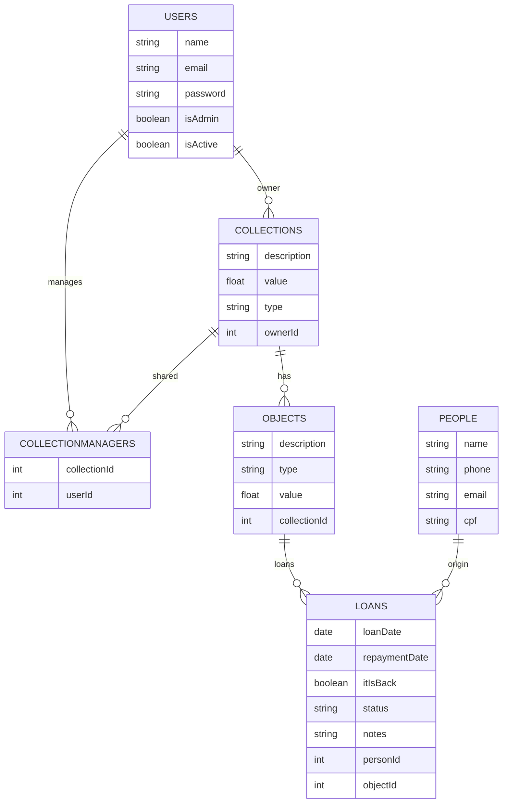
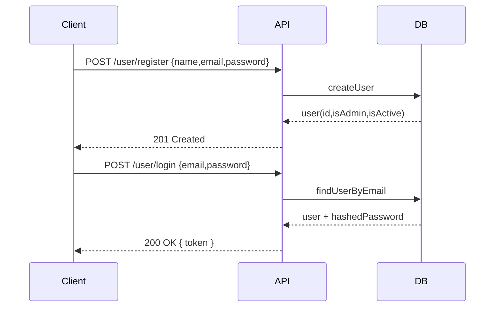
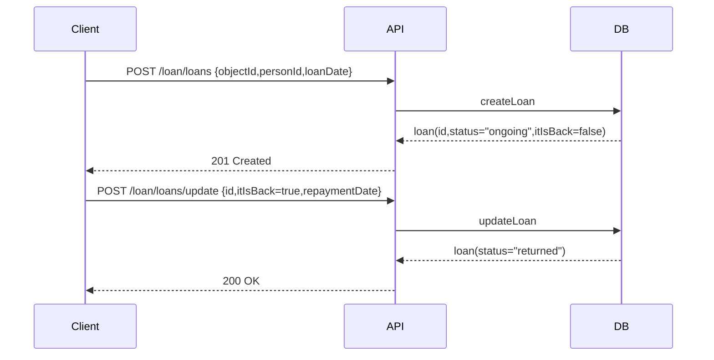

# Controle de Acervo
- API REST com Node.js, Express, Sequelize e SQLite
- Autenticação JWT, RBAC básico (`user` e `admin`)
- Módulos: `user`, `collection`, `object`, `loan`, `person`, `collectionManager`

---

# Visão Geral
- Contexto: cadastro de usuários, coleções e objetos, empréstimos, pessoas
- Modular Monolith com camadas: Model, Service, Controller, Routes, Middleware
- Associações Sequelize centralizadas em `associations.js`

---

# Arquitetura (Boot e Rotas)
- Inicialização lê env, registra associações e monta rotas
- Rotas segmentadas por domínio (`/user`, `/collection`, `/loan`, etc.)

```javascript:d%3A%5CAulas%20PI-II%5CProgramacao_para_internet_II_2025%5CAula%206%5CAPI_Rest_Autenticacao%5Csrc%5Cindex.js
import 'dotenv/config';
import express from 'express';
import connectDB from './config/db.js';
import userRoutes from './modules/user/user.routes.js';
import collectionRoutes from './modules/collection/collection.routes.js';
import loanRoutes from './modules/loan/loan.routes.js';
import personRoutes from './modules/person/person.routes.js';
import { setupAssociations } from './modules/associations.js';
import objectRoutes from './modules/object/object.routes.js';
import collectionManagerRoutes from './modules/collectionmanager/collectionManager.routes.js';
const app = express();
app.use(express.json());
app.use('/user', userRoutes);
app.use('/collection', collectionRoutes);
app.use('/loan', loanRoutes);
app.use('/person', personRoutes);
app.use('/object', objectRoutes);
app.use('/collectionManager', collectionManagerRoutes);
connectDB().then(async (sequelize) => {
  setupAssociations();
  await sequelize.sync({ alter: true });
  app.listen(process.env.PORT || 3000);
});
```

---

# Autenticação e Autorização
- `authenticate`: valida `Authorization: Bearer <token>`
- `req.user` contém `{ userId, isAdmin }`
- `authorizeAdmin`: gate simples para rotas administrativas

```javascript:d%3A%5CAulas%20PI-II%5CProgramacao_para_internet_II_2025%5CAula%206%5CAPI_Rest_Autenticacao%5Csrc%5Cmiddleware%5Cauthenticate.js
import jwt from "jsonwebtoken";
export const authenticate = (req, res, next) => {
  const header = req.headers.authorization;
  if (!header) return res.status(400).json({ message: "Faça o login." });
  const [scheme, token] = header.split(" ");
  if (scheme !== "Bearer" || !token) {
    return res.status(400).json({ message: "Tipo de token inválido ou sem token." });
  }
  try {
    const decoded = jwt.verify(token, process.env.SECRET_JWT);
    req.user = decoded; next();
  } catch {
    return res.status(400).json({ message: "Token inválido ou vencido. Faça login novamente." });
  }
};
export const authorizeAdmin = (req, res, next) => {
  if (!req.user || !req.user.isAdmin) return res.status(403).json({ message: "Acesso negado: apenas administradores" });
  next();
};
```

---

# DER (Mermaid)
- Entidades: `USERS`, `COLLECTIONS`, `OBJECTS`, `PEOPLE`, `LOANS`, `COLLECTIONMANAGERS`
- Campos atualizados: `COLLECTIONS.value`, `LOANS.status`, `LOANS.notes`



---

# Associações (Sequelize)
- Centralização evita ciclo de import e mantém consistência

```javascript:d%3A%5CAulas%20PI-II%5CProgramacao_para_internet_II_2025%5CAula%206%5CAPI_Rest_Autenticacao%5Csrc%5Cmodules%5Cassociations.js
User.hasMany(Collection, { as: "collections", foreignKey: "ownerId" });
Collection.belongsTo(User, { as: "owner", foreignKey: "ownerId" });
Person.hasMany(Loan, { as: "loans", foreignKey: "personId" });
Loan.belongsTo(Person, { as: "person", foreignKey: "personId" });
Collection.hasMany(ObjectItem, { as: "objects", foreignKey: "collectionId" });
ObjectItem.belongsTo(Collection, { as: "collection", foreignKey: "collectionId" });
ObjectItem.hasMany(Loan, { as: "loans", foreignKey: "objectId" });
Loan.belongsTo(ObjectItem, { as: "object", foreignKey: "objectId" });
User.belongsToMany(Collection, { through: CollectionManager, as: "managedCollections", foreignKey: "userId", otherKey: "collectionId" });
Collection.belongsToMany(User, { through: CollectionManager, as: "managers", foreignKey: "collectionId", otherKey: "userId" });
```

---

# Fluxo: Cadastro e Login (Sequência)
- Demonstra retorno do JWT e `req.user` nas rotas privadas



---

# Fluxo: Empréstimo e Devolução (Sequência)
- Criação e atualização do `Loan`



---

# Trecho: Controller de Usuário
- Retorna payload sanitizado e assina JWT no login

```javascript:d%3A%5CAulas%20PI-II%5CProgramacao_para_internet_II_2025%5CAula%206%5CAPI_Rest_Autenticacao%5Csrc%5Cmodules%5Cuser%5Cuser.controller.js
export const newUser = async (req, res) => {
  const user = await createUser(req.body);
  res.status(201).json({
    message: "Usuário cadastrado.",
    user: { id: user.id, name: user.name, email: user.email, isAdmin: user.isAdmin, isActive: user.isActive }
  });
};
```

---

# Trecho: Rotas por Domínio
- Rotas privadas e administrativas (RBAC simples)

```javascript:d%3A%5CAulas%20PI-II%5CProgramacao_para_internet_II_2025%5CAula%206%5CAPI_Rest_Autenticacao%5Csrc%5Cmodules%5Cuser%5Cuser.routes.js
router.post("/register", newUser);
router.post("/login", validateUser);
router.post("/updateData", authenticate, updateUser);
router.get("/usuarios", authenticate, authorizeAdmin, listUsers);
router.post("/delete", authenticate, authorizeAdmin, deleteUser);
router.post("/promote", authenticate, authorizeAdmin, elevateUser);
```

---

# Endpoints — Usuário (`/user`)
- POST `/register` — cadastra usuário
- POST `/login` — retorna JWT
- POST `/updateData` — atualiza dados do usuário logado
- GET `/usuarios` — lista usuários (admin)
- POST `/delete` — desativa usuário (admin)
- POST `/promote` — promove a admin (admin)

---

# Endpoints — Coleção (`/collection`)
- GET `/collections` — lista coleções
- POST `/collections` — cria coleção (admin)
- POST `/collections/update` — atualiza (admin)
- POST `/collections/delete` — remove (admin)
- GET `/collections/:id/managers` — lista gestores (admin)
- POST `/collections/:id/managers` — adiciona gestor (admin)
- DELETE `/collections/:id/managers/:userId` — remove gestor (admin)

---

# Endpoints — Objeto (`/object`)
- GET `/objects` — lista objetos
- POST `/objects` — cria objeto (admin)
- POST `/objects/update` — atualiza (admin)
- POST `/objects/delete` — remove (admin)

---

# Endpoints — Pessoa (`/person`)
- GET `/people` — lista pessoas
- POST `/people` — cria pessoa (admin)
- POST `/people/update` — atualiza (admin)
- POST `/people/delete` — remove (admin)

---

# Endpoints — Empréstimo (`/loan`)
- GET `/loans` — lista empréstimos
- POST `/loans` — cria empréstimo (admin)
- POST `/loans/update` — atualiza empréstimo (admin)
- POST `/loans/delete` — remove empréstimo (admin)

---

# Endpoints — Gestor (`/collectionManager`)
- GET `/collectionManagers?collectionId=:id` — lista (admin)
- POST `/collectionManagers` — adiciona (admin)
- POST `/collectionManagers/delete` — remove (admin)
- Observação: “update” está obsoleto após remoção de `canManage`.
- Preferível usar rotas aninhadas em `/collection` (slide anterior).

---

# Considerações e Boas Práticas
- Sanitização e versionamento de respostas
- Índices e unicidade em `CollectionManager` para evitar duplicação
- Checagens “owner-or-admin” opcionais nas rotas de coleção
- Seeds e testes integrados com os `.http` no diretório `tests/`

---

# Demo Rápido
- `npm install`
- `.env` com `PORT`, `SECRET_JWT`, `SQLITE_PATH`
- `npm run dev` e `http://localhost:3000/`
- Use os arquivos em `tests/*.http` para testar endpoints

---

# Fim
- Código organizado por módulos
- Documentação e DER atualizados
- Aberto a evoluções: soft-delete, owner rules, auditoria